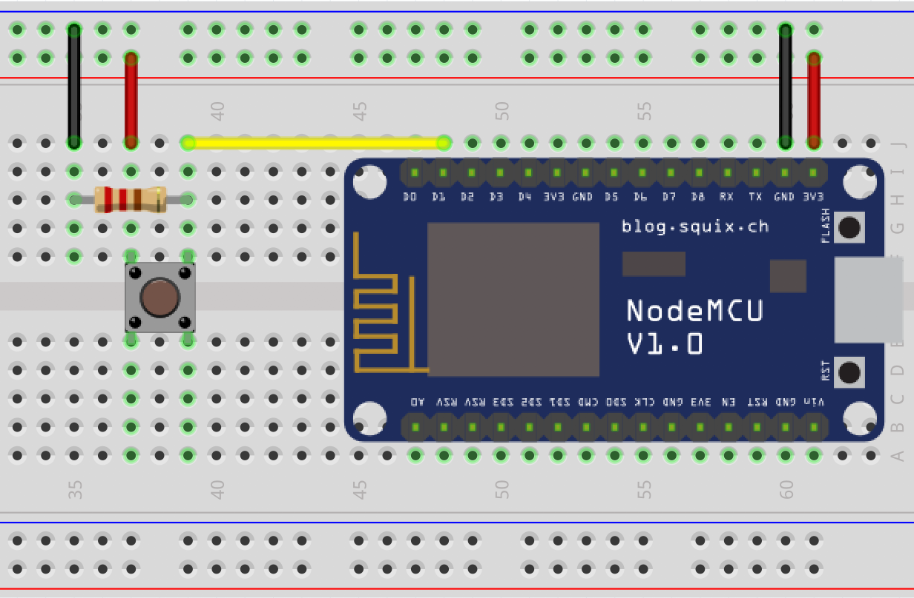
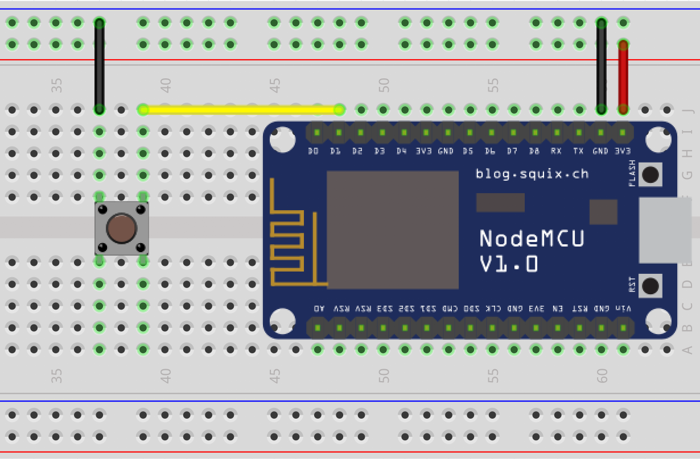
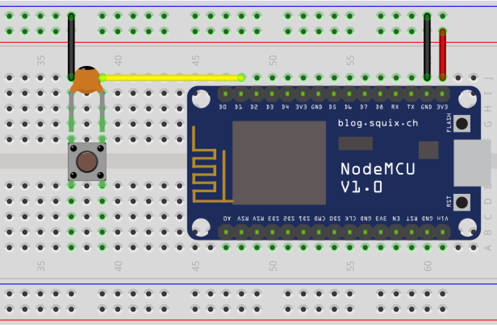

esp-button
==========
Library for [ESP-OPEN-RTOS](https://github.com/SuperHouse/esp-open-rtos) to handle
button input.

Before you start using library, you need to figure out how button is/will be wired.
There are two ways to wire button:
* active high - signal goes from low to high when button is pressed

  
* active low - signal connects to ground when button is pressed

  

```c
#define BUTTON_PIN 5

void button_callback(button_event_t event, void* context) {
    switch (event) {
        case button_event_single_press:
            printf("single press\n");
            break;
        case button_event_long_press:
            printf("long press\n");
            break;
    }
}

button_config_t config = BUTTON_CONFIG(
    .active_level = button_active_high,
);

int r = button_create(BUTTON_PIN, config, button_callback, NULL);
if (r) {
    printf("Failed to initialize a button\n");
}
```

Button config settings:
* **active_level** - `button_active_high` or `button_active_low` - which signal level corresponds to button press. In case of `button_active_low`, it automatically enables pullup resistor on button pin. In case of `button_active_high`, you need to have an additional pulldown (pin-to-ground) resistor on button pin.
* **debounce_time** - number of milliseconds to wait for debounce. During that time signal level changes are ignored.
* **double\_press_time** - if set, defines maximum time to wait for second press to consider it a double press. If set to 0, double press tracking is disabled.
* **long\_press_time** - if set, defines time after which button press is considered a long press. If set to 0, long press tracking is disabled.

Using debounce time improves tracking presses but still in some cases can miss them. Ultimately a better solution would be to use a smoothing capacitor (e.g. 1pF worked for me) and setting `debounce_time` to 0:



```c
button_config_t config = BUTTON_CONFIG(
    .active_level = button_active_low,
    .debounce_time = 0,
);
```

License
=======
MIT licensed. See the bundled [LICENSE](https://github.com/maximkulkin/esp-button/blob/master/LICENSE) file for more details.
